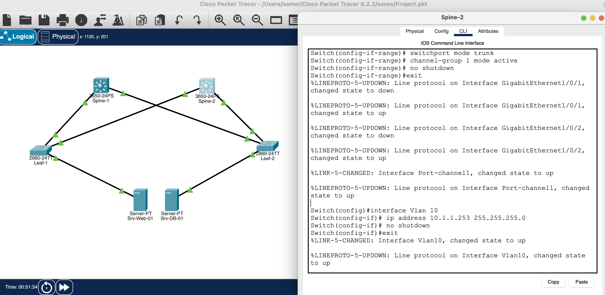
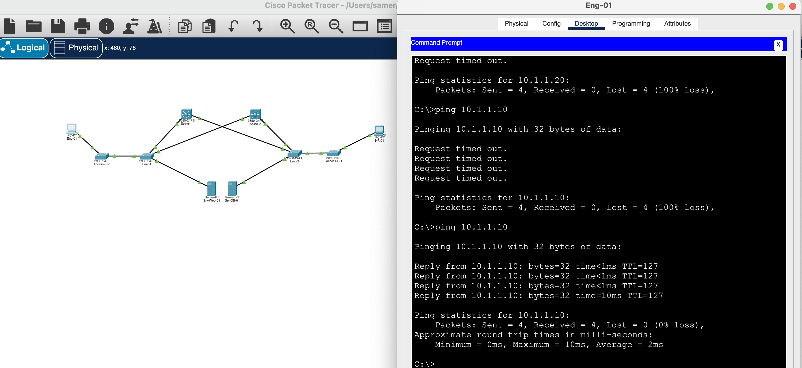
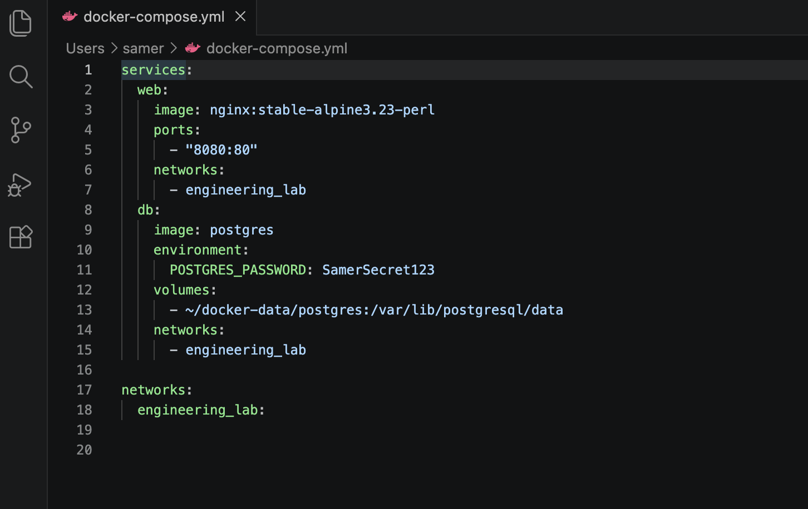
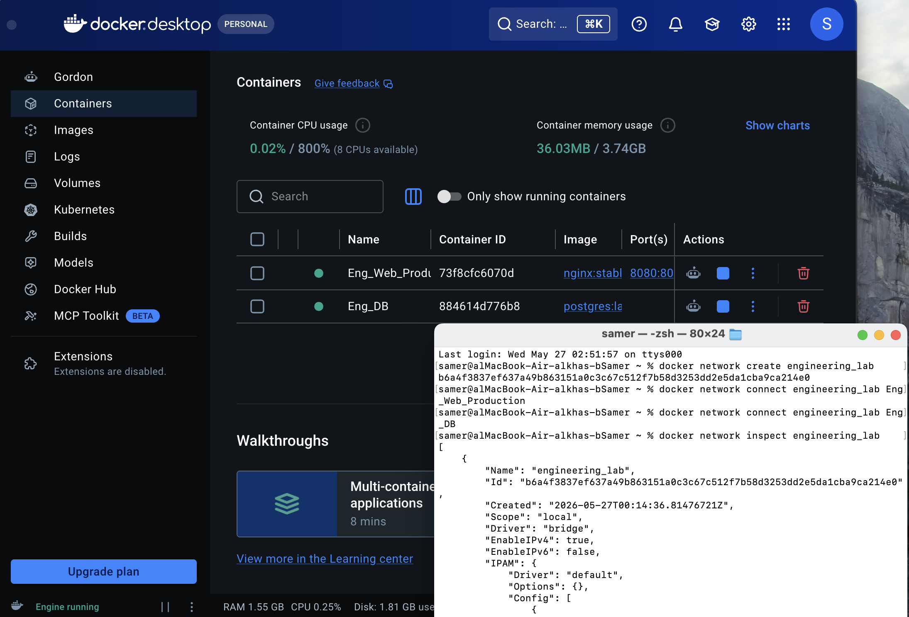
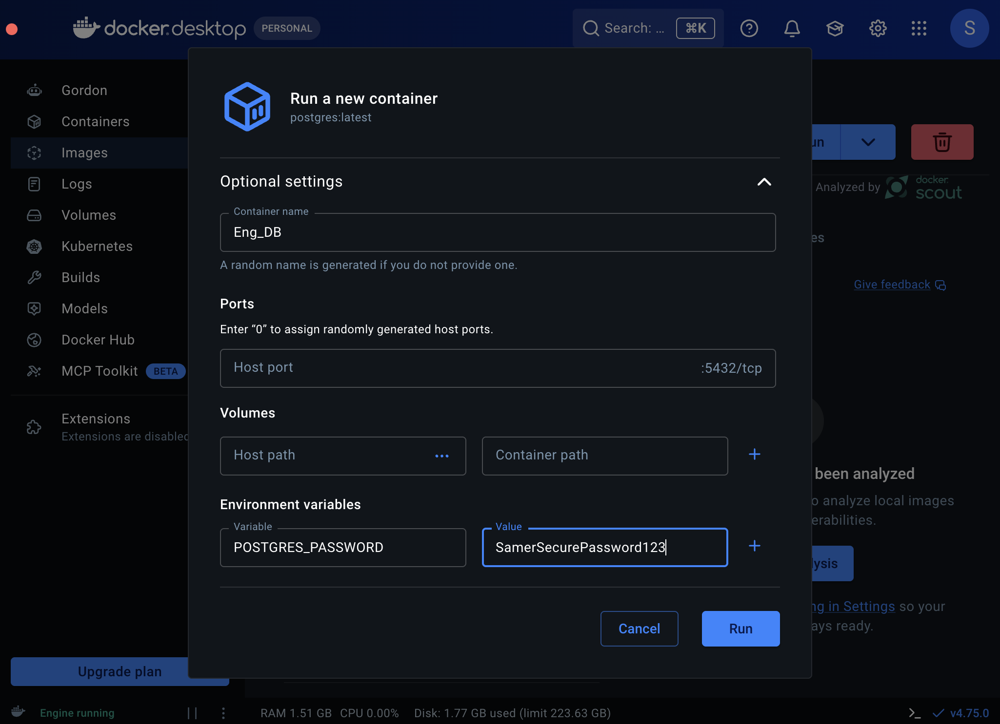
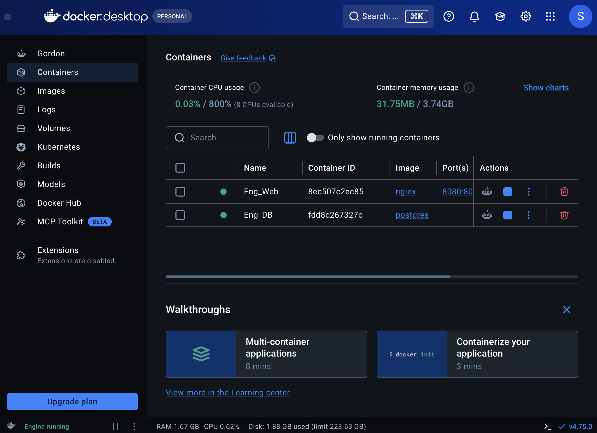

# Hybrid Network and Infrastructure Lab

This project demonstrates the integration of traditional network design principles with modern containerized infrastructure. By combining network simulation and container orchestration, this lab explores how to build resilient, isolated service environments.

## Project Vision

The primary objective of this project is to bridge the gap between network engineering and application deployment:

* **Network Layer:** Utilizing Cisco Packet Tracer to implement a robust Spine-Leaf architecture, ensuring efficient and scalable data flow.
* **Application Layer:** Deploying containerized web services and databases using Docker to ensure environment consistency and simplified management.

## Technical Implementation

### Network Infrastructure
The infrastructure design is based on a Spine-Leaf topology to provide high-bandwidth connectivity and low-latency communication.
* The topology setup and validation are shown in 
* End-to-end connectivity was verified through packet testing, as demonstrated in 

### Containerized Environment
Docker provides an isolated and reproducible runtime environment for applications. This lab utilizes a  file to orchestrate the multi-container setup.

* **Service Deployment:** The environment consists of an NGINX web server and a PostgreSQL database. The deployment process is visible in .
* **Network Isolation:** Services are deployed within a dedicated bridge network (`engineering_lab`) to ensure secure communication between containers.
* **Network Validation:** Connectivity within the Docker environment was confirmed using container network inspection, as seen in  and .

## Infrastructure Configuration

The following configuration defines the services and network architecture:

```yaml
services:
  web:
    image: nginx:stable-alpine3.23-perl
    ports:
      - "8080:80"
    networks:
      - engineering_lab
  db:
    image: postgres
    environment:
      POSTGRES_PASSWORD: SamerSecret123
    volumes:
      - ~/docker-data/postgres:/var/lib/postgresql/data
    networks:
      - engineering_lab

networks:
  engineering_lab:
    driver: bridge